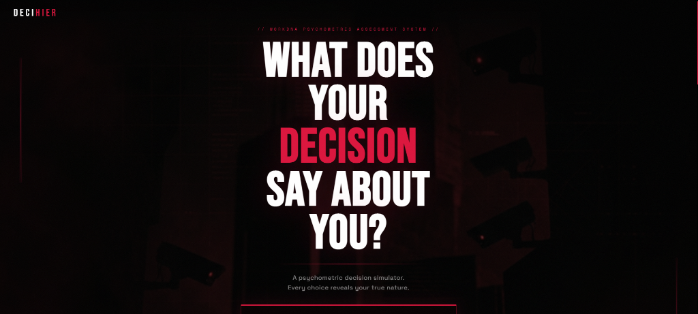

# DeciHire — AI-Powered Hiring Assessment Platform

<div align="center">

**Evaluate candidates beyond correctness. Decode their WorkDNA.**

[](https://python.org)
[](https://flask.palletsprojects.com)
[](https://vercel.com)
[](LICENSE)

🔗 **Live Demo:** [decihire-production.vercel.app](https://decihire-production.vercel.app/)



</div>

---

## 🧬 What is DeciHire?

DeciHire is a next-generation candidate assessment platform that goes beyond right-or-wrong answers. It evaluates candidates across **five critical psychological dimensions** — the **WorkDNA** — by analysing both *what* they answer and *how long* they take.

Unlike traditional MCQ platforms, DeciHire penalises both extremes:
- ⚡ **Too fast** → Heavy penalty (lack of contemplation)
- 🐢 **Too slow** → Heavy penalty (inefficiency)
- ✅ **Optimal time** → Bonus points awarded

---

## ✨ Features

| Feature | Description |
|---------|-------------|
| 🧠 **WorkDNA Scoring** | Evaluates 5 dimensions: TA, SL, ER, BP, BS |
| ⏱️ **Behavioral Timing Engine** | Scores candidates based on response time, not just accuracy |
| 👤 **Candidate Portal** | Login with Test ID + name; complete a timed, personalised assessment |
| 🏢 **HR Dashboard** | Generate test keys per job role; view full candidate reports |
| 📊 **Advanced Analytics** | Raw score, behavioral summary, normalized WorkDNA radar |
| 🎨 **Modern Dark UI** | Animated, dark-mode responsive interface with job role iconography |
| ☁️ **Serverless Deploy** | Zero-config hosting on Vercel |
| 🔑 **Role-Specific Tests** | Tailored question banks: DevOps, Data Scientist, UI/UX, Cloud Architect & more |

---

## 🧬 The 5 WorkDNA Dimensions

| Dimension | Code | What It Measures |
|-----------|------|------------------|
| Technical Acumen | **TA** | Depth of domain knowledge and problem-solving ability |
| Strategic Leadership | **SL** | Vision, decision-making, long-term thinking |
| Ethical Responsibility | **ER** | Integrity, compliance, and values-driven behaviour |
| Business Profitability | **BP** | Commercial mindset, ROI awareness |
| Behavioral Speed | **BS** | Cognitive processing speed under timed pressure |

---

## 🚀 Quick Start

### Prerequisites
- Python 3.8+
- pip
- Git

### Installation

```bash
# Clone the repository
git clone https://github.com/shouryasingh2311/Decihire.git
cd Decihire

# Create and activate virtual environment
python -m venv venv

# Windows
venv\Scripts\activate

# macOS / Linux
source venv/bin/activate

# Install dependencies
pip install -r requirements.txt

# Run the application
python decihire.py
```

Open your browser and navigate to **http://localhost:5000**

---

## 🌐 Routes

| Route | Portal | Description |
|-------|--------|-------------|
| `/` | Candidate | Login with Test ID and name; begin timed assessment |
| `/hr` | HR Admin | Generate new test keys per job role |
| `/hr/dashboard` | HR Admin | View submitted results, WorkDNA scores and analytics |

---

## 🔄 Workflow

```
┌─────────────────────────────────────────────────────┐
│                  DECIHIRE FLOW                      │
├────────────────────┬────────────────────────────────┤
│  HR ADMIN          │  CANDIDATE                     │
│  /hr               │  /                             │
│  ↓                 │  ↓                             │
│  Select job role   │  Enter name + Test ID          │
│  ↓                 │  ↓                             │
│  Generate Test ID  │  Complete timed assessment     │
│  ↓                 │  ↓                             │
│  Share with cand.  │  Thank you page                │
│                    │                                │
│  /hr/dashboard ←───┘                               │
│  View WorkDNA +                                     │
│  behavioral report                                  │
└─────────────────────────────────────────────────────┘
```

---

## 🏗️ Project Structure

```
Decihire/
├── decihire.py          # Main Flask app — routes, scoring engine, session logic
├── questions.json       # Role-specific question bank (multiple job profiles)
├── requirements.txt     # Python dependencies
├── vercel.json          # Vercel serverless deployment config
├── static/              # CSS, JS, assets
└── templates/           # Jinja2 HTML templates
    ├── index.html       # Candidate login & assessment portal
    └── hr/              # HR dashboard templates
```

---

## ⚙️ Scoring Engine

DeciHire's scoring engine evaluates each question response across two axes:

1. **Correctness** — which WorkDNA dimension(s) the selected answer maps to
2. **Response Time** — whether the time taken falls in the optimal band for that question type

### Time-Based Multiplier

| Response Speed | Outcome |
|----------------|---------|
| < Minimum threshold | Heavy penalty applied |
| Within optimal band | Full score + bonus |
| > Maximum threshold | Heavy penalty applied |

Final scores are normalized to produce a WorkDNA percentage for each of the 5 dimensions.

---

## 🛠️ Tech Stack

| Layer | Technology |
|-------|------------|
| Backend | Python 3.8+, Flask 3.x |
| Frontend | Vanilla HTML / CSS / JavaScript |
| Animations | GSAP |
| Question Bank | JSON (role-specific) |
| Session | Flask server-side sessions |
| Hosting | Vercel (Serverless Python) |

---

## 📄 License

MIT License — see [LICENSE](LICENSE) for details.

---

## 🤝 Contributing

Pull requests are welcome! For major changes, please open an issue first to discuss what you'd like to change.

---

<div align="center">

*Built with ❤️ to revolutionise the hiring process*

</div>
